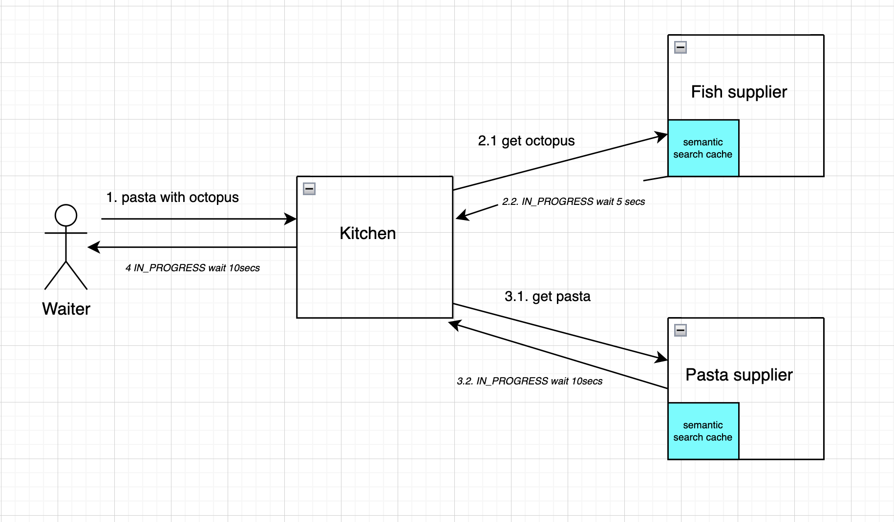
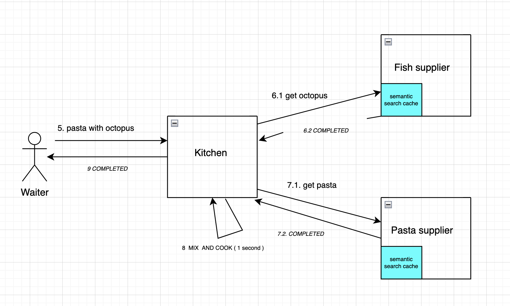

A proof of concept of a polling with back pressure calls.

A **waiter** can do polling request to a kitchen to order some food  
The **kitchen** will call 2 supplier to get the ingredients and when both are ready they will be 
cooked and returned   
A **fish supplier** , supply fish in asynch way. It used an internal semantic search to store the 
result for a given search  
A **pasta supplier** provide pasta with similar functionality of fish supplier  

How to try it:

1. Start fish_supplier  
2. Start pasta_supplier  
3. Start kitchen  

4. Run WaiterTest

Benefits:

1. Threads have very short live.( In kitchen service ) This can mean Better scalability. 
2. No data is kept in memory until It Is really needed ( Cook step ). 
3. Allow back pressure to avoid flooding of suppliers 

To note the very short live of threads in kitchen application

See the diagram in the doc folder for more detailed behaviour

